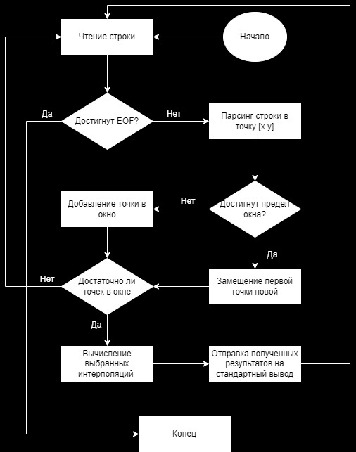

# Лабораторная работа №3

## Цель работы
Получить навыки работы с вводом/выводом, потоковой обработкой данных, командной строкой.

## Требования

В рамках лабораторной работы вам предлагается повторно реализовать лабораторную работу по предмету "Вычислительная математика" посвящённую аппроксимации (в разные годы это лабораторная работа 3 или 4) со следующими дополнениями:


* обязательно должна быть реализована линейная интерполяция (отрезками, [link](https://en.wikipedia.org/wiki/Linear_interpolation));
* настройки алгоритма аппроксимирования и выводимых данных должны задаваться через аргументы командной строки:
    *  какие алгоритмы использовать (в том числе два сразу);
    * частота дискретизации результирующих данных;
    * и т.п.;
* входные данные должны задаваться в текстовом формате на подобии ".csv" (к примеру ```x;y\n``` или ```x\ty\n```) и подаваться на стандартный ввод, входные данные должны быть отсортированы по возрастанию x;
* выходные данные должны подаваться на стандартный вывод;
* программа должна работать в потоковом режиме (пример -- ```cat | grep 11```), это значит, что при запуске программы она должна ожидать получения данных на стандартный ввод, и, по мере получения достаточного количества данных, должна выводить рассчитанные точки в стандартный вывод;

Приложение должно быть организовано следующим образом:
```
    +---------------------------+
    | обработка входного потока |
    +---------------------------+
            |
            | поток / список / последовательность точек
            v
    +------------------------+      +------------------------------+
    | алгоритм аппроксимации |<-----| генератор точек, для которых |
    +------------------------+      | необходимо вычислить         |
            |                       | аппроксимированное значение  |
            |                       +------------------------------+
            |
            | поток / список / последовательность рассчитанных точек
            v
    +------------------------+
    | печать выходных данных |
    +------------------------+
```

Потоковый режим для алгоритмов, работающих с группой точек должен работать следующим образом:

```
o o o o o o . . x x x
  x x x . . o . . x x x
    x x x . . o . . x x x
      x x x . . o . . x x x
        x x x . . o . . x x x
          x x x . . o . . x x x
            x x x . . o o o o o o EOF
```

где:

* каждая строка -- окно данных, на основании которых производится расчёт алгоритма;
* строки сменяются по мере поступления в систему новых данных (старые данные удаляются из окна, новые -- добавляются);

* ```o```-- рассчитанные данные, можно видеть:

    * большинство окон используется для расчёта всего одной точки, так как именно в "центре аппроксимации" результат наиболее точен;
    * первое и последнее окно используются для расчёта большого количества точек, так лучших данных для расчёта у нас не будет.


* ```x``` -- точки, расчёт которых для "окон" не требуется.

Общие требования:

* программа должна быть реализована в функциональном стиле;
* ввод/вывод должен быть отделён от алгоритмов аппроксимации;
* требуется использовать идиоматичный для технологии стиль программирования.

Содержание отчёта:

* титульный лист;
* требования к разработанному ПО, включая описание алгоритма;
* ключевые элементы реализации с минимальными комментариями;
* ввод/вывод программы;
* выводы (отзыв об использованных приёмах программирования).

Общие рекомендации по реализации. Не стоит писать большие и страшные автоматы, управляющие поведением приложения в целом. Если у вас:

* Язык с ленью -- используйте лень.
* Языки с параллельным программированием и акторами -- используйте их.
* Язык без всей этой прелести -- используйте генераторы/итераторы/и т.п.

## Выпполнение

### Общая схема работы программы:



```Clojure
(defn parser-watch [n] ;; Функция-слушатель для преобразования строки в точку
  (fn [_key _agent _old-state new-state]
    (cond
      (nil? new-state)
      (print-line "all lines procedeed")

      :else
      (let [point (str/split new-state #" ")
            x (Double/parseDouble (first point))
            y (Double/parseDouble (second point))]
        (print-line (str "x: " x ", y: " y))
        (send worker-agent (make-struct n x y))))))
```

Стоит заметить, что основные действия происходят через Агентов, к примеру, в данном кусочке кода видно, что есть функция-слушатель для преобразования строки в точку, которая в последствии помещается в окно, в свою очередь которое уже отправляется другому агенту для дальнейших действий. 

```Clojure
(def cli-options [["-h" "--help" ;; Опции для старта программы
                   :desc "Print help Message"
                   :default false]
                  ["-w" "--window NUMBER"
                   :desc "Set window size"
                   :missing "Window size must be set, look for --help"
                   :parse-fn #(Integer/parseInt %)
                   :validate [#(< 1 %) "Must be an integer number greater than 1"]]
                  ["-f" "--frequency NUMBER"
                   :desc "Set frequency"
                   :missing "Frequency must be set, look for --help"
                   :parse-fn #(Double/parseDouble %)
                   :validate [#(< 0 %) "Must be a dobule number greater than 0"]]
                  ["-i" "--linear"
                   :desc "Use linear interpolation"
                   :default false]
                  ["-a" "--lagrange"
                   :desc "Use lagrange interpolation"
                   :default false]])

```

Эта часть кода описывает опции для запуска программы, обязательно должны быть прописаны ```-w```, ```-f```, выбран хотя бы один из методов интерполяции

----------

Программа может работать как в интерактивном режиме вводя данные вручную, так и возможно чтение из файла.

Интерактивный режим:

```
clojure -M -m core -w3 -f0.5 -ia 
1 1
2 3
x: 1.0, y: 1.0
x: 2.0, y: 3.0
i: 1, (x, y): [[1.0 1.0]]
i: 2, (x, y): [[1.0 1.0] [2.0 3.0]]
-----------------
linear values for i: 2
pairs: [[1.0 1.0] [1.5 2.0] [2.0 3.0]]
-----------------
3 5
x: 3.0, y: 5.0
i: 3, (x, y): [[1.0 1.0] [2.0 3.0] [3.0 5.0]]
-----------------
linear values for i: 3
pairs: [[2.0 3.0] [2.5 4.0] [3.0 5.0]]
-----------------
-----------------
lagrange values for i: 3
pairs: [[1.0 1.0] [1.5 2.0] [2.0 3.0] [2.5 4.0] [3.0 5.0]]
-----------------
4 6
x: 4.0, y: 6.0
i: 4, (x, y): [[2.0 3.0] [3.0 5.0] [4.0 6.0]]
-----------------
linear values for i: 4
pairs: [[3.0 5.0] [3.5 5.5] [4.0 6.0]]
-----------------
-----------------
lagrange values for i: 4
pairs: [[2.0 3.0] [2.5 4.13] [3.0 5.0] [3.5 5.63] [4.0 6.0]]
-----------------
5 8
x: 5.0, y: 8.0
i: 5, (x, y): [[3.0 5.0] [4.0 6.0] [5.0 8.0]]
-----------------
linear values for i: 5
pairs: [[4.0 6.0] [4.5 7.0] [5.0 8.0]]
-----------------
-----------------
lagrange values for i: 5
pairs: [[3.0 5.0] [3.5 5.38] [4.0 6.0] [4.5 6.88] [5.0 8.0]]
-----------------
read all lines ended
all lines procedeed
```

Чтение из файла:

```
cat test.txt | clojure -M -m core -w3 -f0.5 -ia // clojure -M -m core -w3 -f0.5 -ia < test.txt
read all lines ended
x: 0.0, y: 10.0
x: 2.0, y: 14.0
x: 4.0, y: 16.0
x: 6.0, y: 18.0
x: 8.0, y: 20.0
x: 9.0, y: 53.0
x: 10.0, y: 34.0
x: 12.0, y: 56.0
all lines procedeed
i: 1, (x, y): [[0.0 10.0]]
i: 2, (x, y): [[0.0 10.0] [2.0 14.0]]
i: 3, (x, y): [[0.0 10.0] [2.0 14.0] [4.0 16.0]]
i: 4, (x, y): [[2.0 14.0] [4.0 16.0] [6.0 18.0]]
i: 5, (x, y): [[4.0 16.0] [6.0 18.0] [8.0 20.0]]
i: 6, (x, y): [[6.0 18.0] [8.0 20.0] [9.0 53.0]]
i: 7, (x, y): [[8.0 20.0] [9.0 53.0] [10.0 34.0]]
i: 8, (x, y): [[9.0 53.0] [10.0 34.0] [12.0 56.0]]
-----------------
linear values for i: 2
pairs: [[0.0 10.0] [0.5 11.0] [1.0 12.0] [1.5 13.0] [2.0 14.0]]
-----------------
-----------------
linear values for i: 3
pairs: [[2.0 14.0] [2.5 14.5] [3.0 15.0] [3.5 15.5] [4.0 16.0]]
-----------------
-----------------
lagrange values for i: 3
pairs: [[0.0 10.0] [0.5 11.19] [1.0 12.25] [1.5 13.19] [2.0 14.0] [2.5 14.69] [3.0 15.25] [3.5 15.69] [4.0 16.0]]
-----------------
-----------------
linear values for i: 4
pairs: [[4.0 16.0] [4.5 16.5] [5.0 17.0] [5.5 17.5] [6.0 18.0]]
-----------------
-----------------
linear values for i: 5
pairs: [[6.0 18.0] [6.5 18.5] [7.0 19.0] [7.5 19.5] [8.0 20.0]]
-----------------
-----------------
lagrange values for i: 4
pairs: [[2.0 14.0] [2.5 14.5] [3.0 15.0] [3.5 15.5] [4.0 16.0] [4.5 16.5] [5.0 17.0] [5.5 17.5] [6.0 18.0]]
-----------------
-----------------
linear values for i: 6
pairs: [[8.0 20.0] [8.5 36.5] [9.0 53.0]]
-----------------
-----------------
linear values for i: 7
pairs: [[9.0 53.0] [9.5 43.5] [10.0 34.0]]
-----------------
-----------------
linear values for i: 8
pairs: [[10.0 34.0] [10.5 39.5] [11.0 45.0] [11.5 50.5] [12.0 56.0]]
-----------------
-----------------
lagrange values for i: 5
pairs: [[4.0 16.0] [4.5 16.5] [5.0 17.0] [5.5 17.5] [6.0 18.0] [6.5 18.5] [7.0 19.0] [7.5 19.5] [8.0 20.0]]
-----------------
-----------------
lagrange values for i: 6
pairs: [[6.0 18.0] [6.5 10.5] [7.0 8.33] [7.5 11.5] [8.0 20.0] [8.5 33.83] [9.0 53.0]]
-----------------
-----------------
lagrange values for i: 7
pairs: [[8.0 20.0] [8.5 43.0] [9.0 53.0] [9.5 50.0] [10.0 34.0]]
-----------------
-----------------
lagrange values for i: 8
pairs: [[9.0 53.0] [9.5 41.0] [10.0 34.0] [10.5 32.0] [11.0 35.0] [11.5 43.0] [12.0 56.0]]
-----------------
```

## Заключение
Данная лабораторная работа помогла лучше понять написание кода на функциональном языке Clojure, познакомился с инструментом чтением аргументов командной строки, так же поработал с Агентами, которые позволили асинхронно распараллелить выполнение программы.
